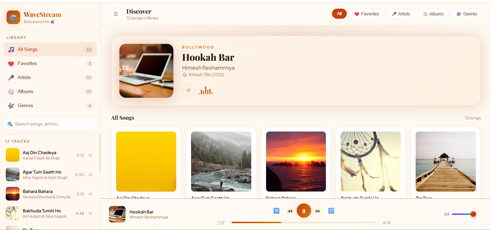
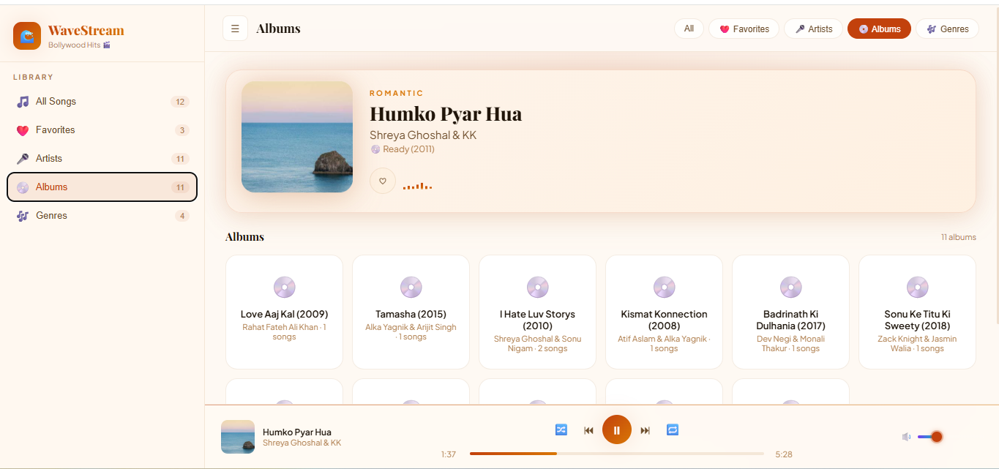

## 📸 Screenshots

### 🌞 Light Mode

### 🌙 Dark Mode

🌊 WaveStream – Bollywood Music Player

WaveStream is a modern, fully responsive, and beautifully animated web-based music player designed for Bollywood music lovers.
It delivers a premium UI/UX experience with smooth animations, interactive controls, and both Light & Dark themes for enhanced user comfort.

✨ Features
🎧 Core Music Player Features

Play / Pause / Next / Previous controls

Shuffle mode

Repeat modes (None / All / One)

Interactive progress bar (seek functionality)

Real-time duration display

Volume control with dynamic icon

Mini-player for mobile devices

Keyboard shortcuts support

🎨 UI & Design

🌗 Light & Dark Theme Toggle

Smooth animations & floating album artwork

Animated equalizer effect

Glassmorphism-inspired UI

Fully responsive layout (Desktop + Tablet + Mobile)

Collapsible sidebar

Modern typography & aesthetic gradients

📚 Library Features

All Songs view

Favorites system (stored in LocalStorage)

Browse by:

Artists

Albums

Genres

Real-time search (songs, artists, albums, genres)

Dynamic song counters

🛠️ Built With

HTML5

CSS3 (Custom properties, animations, responsive design)

Vanilla JavaScript (ES6)

LocalStorage API

Audio API

📂 Project Structure
WaveStream/
│── index.html
│── pic/
│    ├── 1st.png
│    ├── 2nd.png
│── assets/
📱 Responsive Design

WaveStream is fully optimized for:

💻 Desktop

📱 Mobile Devices

📲 Tablets

Mobile view includes a dedicated mini-player interface for better usability.

🌗 Theme Support

WaveStream supports:

☀️ Light Mode

🌙 Dark Mode

Users can switch themes seamlessly for a personalized listening experience.

💾 Local Storage Support

The app stores:

Favorite songs

Volume preference

Last played track

Player state

So your experience remains persistent even after refreshing the page.

🎼 Sample Songs Included

The player includes Bollywood tracks from artists such as:

Arijit Singh

Atif Aslam

Shreya Ghoshal

Rahat Fateh Ali Khan

Sonu Nigam

Alka Yagnik

(Audio files are streamed from public sources for demo purposes.)

📸 Screenshots
🌞 Light Mode

🌙 Dark Mode

🚀 How to Run Locally

Clone the repository:

git clone https://github.com/your-username/wavestream.git

Open the project folder.

Open index.html in your browser.

No additional setup required ✅

🎯 Learning Highlights

This project demonstrates:

Advanced CSS layout (Grid + Flexbox)

Glass UI effects

State management in Vanilla JS

Audio control handling

Dynamic DOM rendering

Responsive UI architecture

📌 Future Improvements

Playlist creation feature

Backend integration

User authentication

Real-time streaming API integration

PWA support

👨‍💻 Author

Ali Raza Baloch
Software Engineering Student | Frontend Developer

GitHub: https://github.com/Ali1414-developer

⭐ Support

If you like this project, please ⭐ star the repository and share your feedback!
